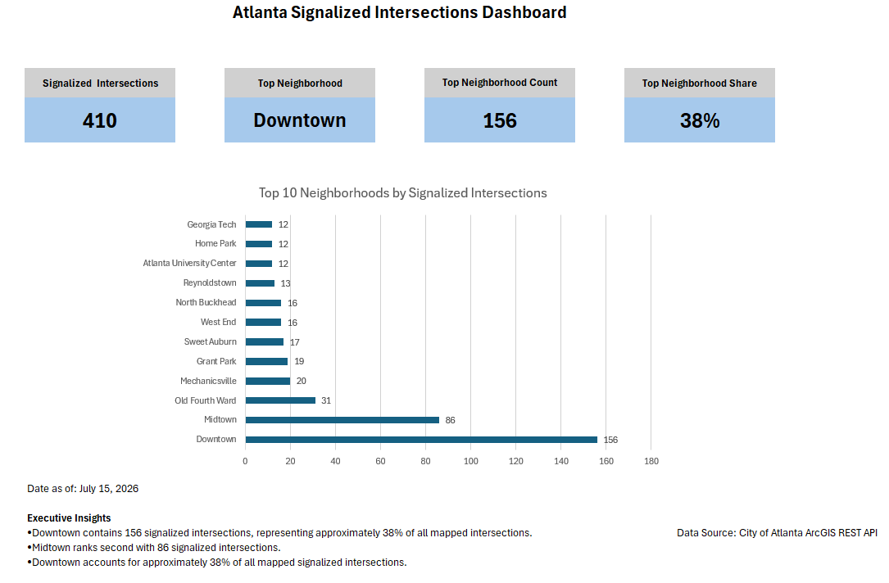

# Atlanta Signalized Intersections Dashboard

## Project Overview
This project analyzes signalized intersections throughout the City of Atlanta using publicly available ArcGIS REST API data. The data was imported into Excel using Power Query, transformed for analysis, and summarized with PivotTables. An executive dashboard was created to identify the neighborhoods with the highest concentration of signalized intersections and present key findings through KPI cards and data visualizations.

## Business Problem
Determine which Atlanta neighborhoods contain the highest concentration of signalized intersections and present the results through an executive dashboard.

## Key Insights
- Downtown contains the highest number of signalized intersections (156).
- Midtown ranks second with 86 intersections.
- Downtown represents approximately 38% of all mapped signalized intersections.
- The dashboard highlights the top 10 neighborhoods by intersection count.

## Tools Used
- Microsoft Excel
- Power Query
- PivotTables
- KPI Cards
- Data Visualization
- ArcGIS REST API
- GitHub

## Skills Demonstrated
- Data Cleaning
- Data Transformation
- Dashboard Design
- KPI Development
- Data Visualization

## Dashboard

## Files
- Excel Workbook
- Power BI Report
- Documentation
